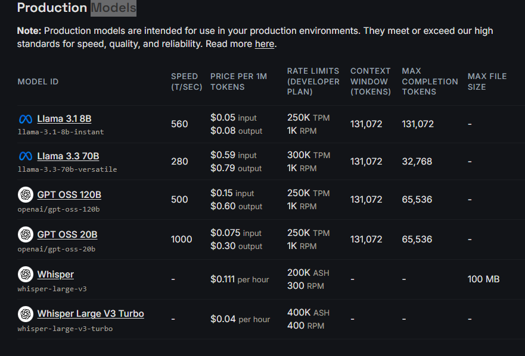

# [什麼是 Groq？](https://groq.com/)

在開始寫程式之前，先認識一個近年 AI 開發者很常使用的平台──Groq。

很多人第一次看到 Groq，都會以為它是另一個大型語言模型(LLM)。

其實不是。

Groq **不是 AI 模型**，而是一家提供 **超高速 AI 推論(Inference)** 的公司。

可以把它想成：

> OpenAI 提供 GPT、Google 提供 Gemini，而 Groq 提供的是「讓這些模型跑得非常快」的平台。

## 發展的改變

以前如果要做 AI，大多都是：圖片 -> 自己訓練模型 -> 部署模型 -> 自己維護 GPU

這種方式需要：

- GPU
- CUDA
- TensorFlow
- PyTorch
- Linux Server

對初學者來說，門檻相當高。

現在不同了。大型語言模型(LLM)出現後，只需要呼叫 API。

例如：Python -> 送出文字 -> AI 回覆結果

整個 AI 開發變得非常簡單。

但是又出現新的問題。

> **AI 很慢。**

例如：

```
請分析這張圖片
```

送出去之後可能要等待：

```
3 秒
5 秒
8 秒
甚至更久
```

如果只是聊天還可以接受。

但是如果是：

- 即時監控
- AI 攝影機
- 機器人
- 智慧工廠

等待數秒就太久了。

這時候，Groq 就誕生了。

Groq 是一家專門做 **AI 推論(Inference)** 的公司。

它並沒有自己訓練 GPT。

也沒有自己訓練 Gemini。

它的專長只有一件事：

> **讓 AI 回答得更快。**

很多 AI 公司都專注在訓練模型(Training)，Groq 則專注在執行模型(Inference)，這也是它最大的特色。

## 什麼是 AI 推論(Inference)？

## 什麼是 AI 推論(Inference)？

AI 的運作大致分成兩個階段：**訓練(Training)** 與 **推論(Inference)**。

訓練階段會利用大量資料讓 AI 學習知識與規律，需要消耗大量 GPU 運算資源，通常要花上數天、數週，甚至數個月才能完成。

完成訓練後，模型便進入推論階段。當使用者提出需求，例如翻譯文字、撰寫程式、分析圖片或回答問題時，AI 會根據訓練好的模型快速產生答案，這個過程就稱為 **Inference(推論)**。

**Groq 並不負責訓練模型，而是專注於最佳化 AI 的推論速度，因此能在極短時間內回應使用者的請求。**

## Groq 與 OpenAI、Gemini 有什麼不同？

| 項目             | Groq                     | OpenAI     | Gemini        |
| ---------------- | ------------------------ | ---------- | ------------- |
| 是否自行開發模型 | 部分，也提供大量開源模型 | ✔ GPT 系列 | ✔ Gemini 系列 |
| API 回應速度     | ⭐⭐⭐⭐⭐               | ⭐⭐⭐     | ⭐⭐⭐        |
| 程式碼能力       | ⭐⭐⭐⭐⭐               | ⭐⭐⭐⭐⭐ | ⭐⭐⭐⭐      |
| 圖片理解         | 視模型而定               | ✔          | ✔             |
| 成本             | 通常較低                 | 中等       | 中等          |
| 適合 AI Agent    | ⭐⭐⭐⭐⭐               | ⭐⭐⭐⭐   | ⭐⭐⭐⭐      |

> **補充：** Groq 的特色在於提供高速推論平台，實際能使用哪些模型、是否支援圖片、多模態能力等，都取決於你選擇的模型，而不是 Groq 平台本身。

## 建立 API Key

```
GROQ_API_KEY=your_groq_api_key_here
```

## Models



### API測試

- [測試](./Groq_src/測試Groq.py)
- [Groq&Gradio介面](./Groq_src/Groq&Gradio介面.py)
- [Groq&發票收據OCR實作](./Groq_src/Groq&發票收據OCR實作.py)
