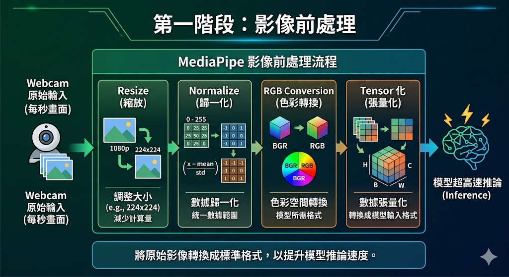
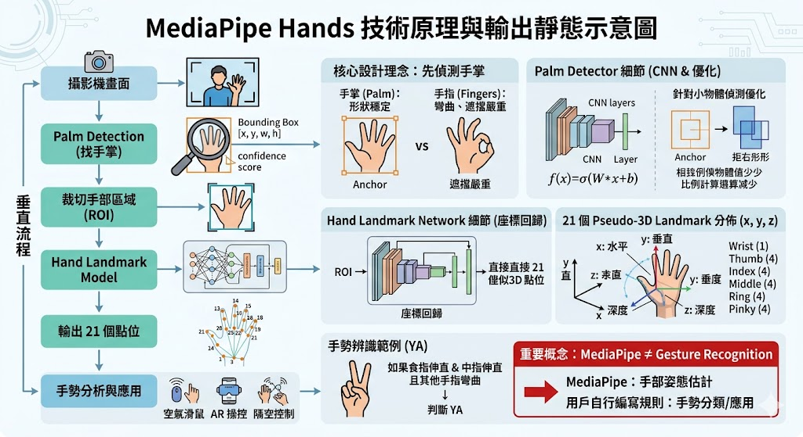

# MediaPipe

MediaPipe 是一套很適合初學者入門 AI 視覺互動的工具。你不需要先會訓練大型模型，也不需要一開始就懂深度學習數學；你可以先用它做出看得見、玩得到、跟生活有關的作品。

## MediaPipe 到底在做什麼

你可以把 MediaPipe 想成一位「很會看圖的助教」。你把一張畫面交給它，它會回傳一些座標點，例如：

- 人臉在哪裡
- 眼睛、鼻子、嘴巴的位置
- 手指每個關節的位置
- 肩膀、手肘、膝蓋的位置
- 哪些像素是人，哪些像素是背景

這些座標點稱為 landmark。程式拿到 landmark 之後，就可以做很多判斷：

- 眼睛上下距離很小：可能閉眼
- 嘴巴上下距離很大：可能打哈欠
- 拇指和食指距離變大：音量變大
- 膝蓋角度變小再變大：完成一次深蹲

也就是說，MediaPipe 不只是「偵測」，它是把影像變成程式可以計算的資料。

## 安裝環境

```
uv add mediapipe opencv-python numpy
```

## [測試讀取Webcam](./MediaPipe_src/測試讀取Webcam.py)

大部分 MediaPipe 專案的流程都很像：

1. OpenCV 從 Webcam 讀一張畫面
2. 把 BGR 色彩轉成 RGB
3. 交給 MediaPipe 偵測
4. 讀取偵測結果
5. 用 OpenCV 把文字、框線、骨架畫回畫面

為什麼要轉 RGB？因為 OpenCV 預設讀到的是 BGR，但 MediaPipe 通常吃 RGB。

這就像兩個人都在講顏色，只是順序不同，所以要先翻譯。


## Face Detection(臉部辨識)

- [How Does Facial Recognition Work?](https://www.youtube.com/watch?v=agGEDdj05U0&t=37s)
- [How Facial Recognition Works | Local Binary Patterns Explained](https://www.youtube.com/watch?v=6zX7YhNRH44)

## Face Detection

- [How Does Facial Recognition Work?](https://www.youtube.com/watch?v=agGEDdj05U0&t=37s)
- [How Facial Recognition Works | Local Binary Patterns Explained](https://www.youtube.com/watch?v=6zX7YhNRH44)

Face Detection 的任務是從影像中找出「人臉的位置」。

它不是在判斷這個人是誰，也不是分析表情，而是先回答一個很基礎但很重要的問題：「畫面中有沒有人臉？人臉大概在哪裡？」

程式拿到一張圖片後，模型會在畫面中掃描可能是人臉的區域。找到後，就用框線標出來。

```
原始影像
↓
偵測人臉位置
↓
取得臉部框座標
↓
裁切人臉或送到下一個 AI 模型
```

模型通常會輸出：

- 人臉框座標：x, y, width, height
- 信心分數：模型有多確定這是一張臉
- 可能還會提供簡單關鍵點：眼睛、鼻子、嘴角位置

### MediaPipe Face Detection 的核心概念

MediaPipe 的 Face Detection 並不是整張圖慢慢掃描每個區域；它用的是：

- 單次深度學習推論
- 直接預測人臉位置

MediaPipe的 Face Detection背後其實是BlazeFace 模型，這是 Google 專門為手機 GPU 與即時運算設計的人臉偵測模型。可以把它想成：「超輕量版的人臉 YOLO。」

實際流程大概是這樣：

```
攝影機畫面
↓
影像縮放與前處理
↓
BlazeFace 模型推論
↓
輸出候選人臉框
↓
過濾重複框
↓
得到最終人臉位置
```


### Face Detection 適用場景

- AI 人臉出現提醒器：偵測畫面中是否有人臉出現，適合做簡易監控或互動裝置。
- 教室人流統計：計算畫面中出現多少張臉，用來粗略估計人數，但不適合直接當精準點名。
- 人臉照片裁切：自動把大頭照、人像照中的臉裁切出來，方便後續建資料集。
- 視訊會議狀態偵測：判斷使用者是否還在畫面中，或是否長時間離開鏡頭。
- 隱私保護：偵測人臉後自動加馬賽克、模糊或遮罩，常用在行車紀錄器、監視器影像處理。
- 人臉辨識前處理：先找臉，再把臉送進 face_recognition、InsightFace、DeepFace 等模型分析。

### 第一階段：影像前處理

當 Webcam 每秒輸入畫面後，MediaPipe 不會直接拿原圖去跑(速度會太慢)。MediaPipe通常會

- resize
- normalize
- RGB conversion
- tensor 化

這樣模型才能超高速推論。



### 第二階段：BlazeFace 模型推論

BlazeFace 本質上是CNN(卷積神經網路)。一般 CNN 很耗運算，BlazeFace 改用Depthwise Conv + Pointwise Conv這種結構。效果是：

- 大幅降低參數量
- GPU 更快
- 手機更省電

這也是 MobileNet 系列常見技巧。


### 第三階段：輸出 Bounding Box

模型最後會輸出：`[x, y, w, h]`，例如`[320, 180, 150, 150]`，代表：

- 左上角位置
- 人臉寬度
- 人臉高度

同時還會輸出confidence score，例如：0.93，表示模型有 93% 信心這是人臉。


### 第四階段：Non-Max Suppression(NMS)

因為模型可能會：對同一張臉框很多次。例如：

```
框1：95%
框2：92%
框3：89%
```

這時候會做：NMS 去重複。簡單講：

```
保留最好的框，把重疊太高的其他框刪掉。不然畫面會變一張臉很多框
```

.png>)

- [補充：非极大值抑制(NMS)详解：目标检测中的“去重神器”](https://jishuzhan.net/article/1956552713357012993)
- [範例：基本人臉偵測](./MediaPipe_src/基本人臉偵測.py)
- [範例：人臉偵測-線上狀態提醒](./MediaPipe_src/人臉偵測-線上狀態提醒.py)
- [範例：人臉偵測-線上狀態提醒-串接TG_Bot](./MediaPipe_src/人臉偵測-線上狀態提醒-串接TG_Bot.py)
- [範例：教室出席統計](./MediaPipe_src/教室出席統計.py)

## Face Mesh

Face Mesh 的任務不是「找臉在哪裡」，而是進一步把臉部結構拆成一個可計算的幾何網格。

Face Detection 只會給你一個人臉框：Face Mesh 則會告訴你：

```
眼睛在哪裡
眉毛在哪裡
鼻樑在哪裡
嘴唇在哪裡
下巴輪廓在哪裡
臉部表面怎麼分布
```


### Face Mesh 適合做什麼？

| 應用         | 說明                   |
| ------------ | ---------------------- |
| 眨眼偵測     | 判斷眼睛是否閉合       |
| 疲勞偵測     | 長時間閉眼或頻繁眨眼   |
| 嘴巴開合偵測 | 說話、打哈欠、張嘴     |
| 頭部姿態估計 | 判斷是否看向鏡頭       |
| AR 濾鏡      | 貼上眼鏡、鬍子、面具   |
| 虛擬化妝     | 口紅、眼影、臉部修飾   |
| 臉部互動遊戲 | 用眨眼、張嘴控制畫面   |
| 表情特徵擷取 | 把臉部變化轉成數值特徵 |

### Face Mesh 的限制

它會受到幾個因素影響：

| 問題         | 可能影響                 |
| ------------ | ------------------------ |
| 臉太小       | 點位不穩或抓不到         |
| 光線不足     | landmark 抖動            |
| 側臉角度太大 | 部分點位容易失準         |
| 遮擋         | 手、口罩、眼鏡會影響定位 |
| 快速移動     | 點位可能延遲或飄移       |
| 多人場景     | 運算量增加，穩定度下降   |
| 低解析度     | 五官細節不足             |

### [基於Mediapipe的Face Mesh](./MediaPipe_src/基於Mediapipe的Face_Mesh.py)

MediaPipe Face Mesh 會在臉上標出 468 個臉部關鍵點。這些點不是隨便灑在臉上，而是按照臉部解剖結構排列，形成一張完整的臉部拓撲網格。

468 個點可以涵蓋臉部主要區域：

| 區域     | 可分析內容           |
| -------- | -------------------- |
| 眼睛     | 眨眼、閉眼、視線方向 |
| 眉毛     | 皺眉、挑眉           |
| 鼻子     | 臉部中心、頭部姿態   |
| 嘴巴     | 張嘴、說話、微笑     |
| 臉頰     | 臉部變形、表情變化   |
| 下巴     | 頭部角度、嘴部開合   |
| 臉部輪廓 | 臉型、轉頭方向       |


### [範例：閉眼偵測](./MediaPipe_src/閉眼偵測.py)

閉眼偵測常用一個概念：

```
眼睛縱向高度 / 眼睛橫向寬度
```

這個比例常被稱為 EAR(Eye Aspect Ratio)。

眼睛張開時：

- 上下距離比較大
- 左右距離固定
- EAR 較高

眼睛閉上時：

- 上下距離變小
- 左右距離幾乎不變
- EAR 變低

所以我們可以用很直覺的規則：

```
如果 EAR 低於某個門檻
↓
判斷眼睛可能閉上
```

這種方法的好處是簡單、即時、可解釋。缺點是每個人的眼型、鏡頭角度、臉部距離不同，所以門檻通常要稍微調整。

### [範例：嘴巴開合偵測](./MediaPipe_src/嘴巴開合偵測.py)

嘴巴開合也是同樣邏輯。

我們可以取：

- 上嘴唇點
- 下嘴唇點
- 左嘴角點
- 右嘴角點

然後計算：

```
嘴巴上下距離 / 嘴巴左右寬度
```

當上下距離變大，就可能代表：

- 正在說話
- 打哈欠
- 張嘴
- 驚訝表情

但這裡要小心。Face Mesh 只能看出嘴巴形狀變化，不能直接知道原因。

所以比較嚴謹的說法會是偵測到嘴部開合幅度增加。而不是直接說：這個人正在說話

## Hands

MediaPipe 的 Hands，不只是「看到一隻手」。

它其實做了兩件事：

```
1. 找到手在哪裡
2. 精準預測手部關節位置
```

所以你看到畫面上的：手腕、指節、指尖、每根手指彎曲，背後其實是即時 3D 手部姿態估計(Hand Pose Estimation)



### Hands相關應用

| 應用         | 原理             |
| ------------ | ---------------- |
| 空氣滑鼠     | 食指座標控制游標 |
| 空氣畫筆     | 指尖軌跡繪圖     |
| 投影片控制   | 左右揮手切頁     |
| 手勢音量控制 | 手指距離映射音量 |
| AI 鋼琴      | 指尖碰撞虛擬鍵盤 |
| AR 遊戲      | 手掌控制角色     |
| 手語辨識     | landmark + LSTM  |
| 疲勞偵測     | 手托下巴行為分析 |

- [範例：基本手指辨識](./MediaPipe_src/基本手指辨識.py)
- [範例：手指距離控制音量](./MediaPipe_src/手指距離控制音量.py)
- [範例：手指復健](./MediaPipe_src/手指復健.py)
- [範例：雙手辨識0-10](./MediaPipe_src/雙手辨識0-10.py)
- [範例：單雙手都可算1-10](./MediaPipe_src/單雙手都可算1-10.py)
- [範例：比手勢換圖片](./MediaPipe_src/比手勢換圖片.py)
  - [影片素材](https://www.instagram.com/reels/DV-qbM2Ez5q/)
- [範例：MediaPipe 手指數字儀表板](./MediaPipe_src/MediaPipe手指數字儀表板.py)
- [範例：MediaPipe手指關節截圖](./MediaPipe_src/MediaPipe手指關節截圖.py)

## Pose

Pose(人體姿態估計)的核心目標是：讓 AI 理解「人體怎麼動」。

它不只是看到：畫面中有一個人，而是進一步理解：

```
手在哪裡
腳在哪裡
肩膀在哪裡
膝蓋彎了多少
人是站著還是跌倒
```

所以 Pose 本質上是一種人體骨架追蹤(Human Pose Estimation)。系統會在人體上建立：

- 關節點
- 骨架連線
- 人體幾何結構

最後把人的動作，轉成程式可以分析的座標資料

### 基於mediapipe實作Pose

整條 pipeline 大概是：

```
攝影機畫面
↓
Person Detection(找人)
↓
ROI 人體裁切
↓
Pose Landmark Model
↓
輸出 33 個人體關鍵點
↓
骨架分析
↓
角度/動作判斷
```

### 第一步：Person Detection(找到人體)

模型不會直接分析整張畫面。

它會先回答一個問題：

人在哪裡？

找到人體位置後，後續只需要分析人體區域即可。


### 第二步：ROI 裁切

例如：原圖1920x1080，找到人體後裁切成較小區域。例如256x256

這可以大幅降低GPU 負擔、推論時間、記憶體使用量


### 第三步：Pose Landmark Model

模型會直接預測33 個人體 landmark。包含：

| 部位   | 點位             |
| ------ | ---------------- |
| 頭部   | 鼻子、眼睛、耳朵 |
| 上半身 | 肩膀、手肘、手腕 |
| 手部   | 手指基底         |
| 下半身 | 髖部、膝蓋、腳踝 |
| 足部   | 腳跟、腳尖       |


- [範例：深蹲影片計數](./MediaPipe_src/深蹲影片計數.py)
- [範例：伏地挺身影片計數](./MediaPipe_src/伏地挺身影片計數.py)
- [範例：駝背提醒](./MediaPipe_src/駝背提醒.py)

## Selfie Segmentation(人物去背)

Selfie Segmentation 的工作很單純：把人和背景分開。

```text
# 例如原本的畫面：
人物 + 教室背景

# 經過模型處理後：
人物
+
背景
```


### 模型如何判斷？

模型會檢查畫面中的每個像素。

例如：

```text
這個像素是人嗎？
```

如果答案為是，就保留下來；如果答案為否，就當成背景。

最後形成一張遮罩圖(Mask)。

```text
白色 = 人物

黑色 = 背景
```

- [範例：背景糊化](./MediaPipe_src/背景糊化.py)
