# OpenCV

OpenCV 全名是 Open Source Computer Vision Library。

它是一套「電腦視覺」與「影像處理」的超主流函式庫。

簡單講：它讓程式可以「看懂畫面」。像是：

- 讀取圖片
- 操作影片
- 偵測人臉
- 找輪廓
- 辨識物件
- 做 AI 視覺前處理
- 即時攝影機分析

很多 AI 視覺專案，其實底層都會搭配 OpenCV。


## 安裝套件

```
uv add opencv-python
```

- [範例：測試OpenCV](./OpenCV_src/測試OpenCV.py)

## 影像是 NumPy 陣列

很多人剛接觸 OpenCV 時，會以為圖片是一個很神秘的東西。

但其實不是。

對電腦來說：圖片本質上就是一大堆數字。而 OpenCV 讀進來後，會把圖片變成 numpy.ndarray。


## 灰階圖片：電腦其實看不懂「圖片」，它只看得懂數字

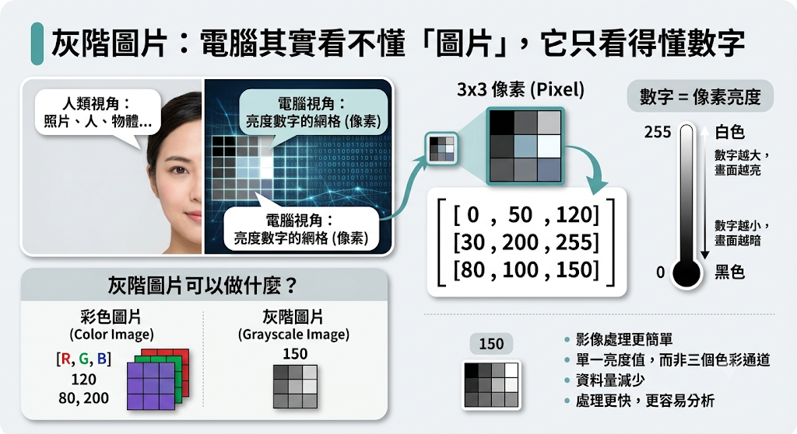

我們人看到圖片時，會覺得這是一張照片、一個人、一隻貓，或是一個物品。

但電腦不是這樣看的。電腦看到圖片時，其實看到的是一堆數字。每一個數字，都代表圖片中某一個小格子的亮度。這個小格子，就叫做「像素」(pixel)。

假設現在有一張很小很小的黑白圖片，它只有 3 × 3 個像素。

電腦看到的內容可能長這樣：

```
[
    [0, 50, 120],
    [30, 200, 255],
    [80, 100, 150]
]
```

這看起來不像圖片，對吧？ 但對電腦來說，這就是圖片。

每一個數字代表一個像素的亮度：

```
0 = 黑色
255 = 白色
中間值 = 不同深淺的灰色

所以數字越小，畫面越暗。
數字越大，畫面越亮。
```

### 灰階圖片可以做什麼？

很多影像處理任務會先把圖片轉成灰階，因為灰階圖片比較簡單。

彩色圖片有紅、綠、藍三個通道。但灰階圖片只有一個亮度值。

```
# 彩色圖片每個像素可能長這樣：
[120, 80, 200]

# 但灰階圖片每個像素只會是一個數字：
150
```

資料變少了，電腦處理起來就更快，也更容易分析。

- [範例：把彩色圖片轉成灰階圖片](./OpenCV_src/把彩色圖片轉成灰階圖片.py)

## 色彩空間

電腦其實有很多種「描述顏色的方法」，就像人類描述天氣：

- 有人說「很熱」
- 有人說「35度」
- 有人說「體感像烤箱」

都是同一件事。只是描述方式不同。而色彩空間也是這樣。

| 色彩空間 | 代表意思            | 資料格式                   | 適合做什麼               | 初學者理解方式         |
| -------- | ------------------- | -------------------------- | ------------------------ | ---------------------- |
| BGR      | OpenCV 預設顏色格式 | `[Blue, Green, Red]`       | OpenCV 影像處理          | OpenCV 自己的顏色順序  |
| RGB      | 一般世界常見格式    | `[Red, Green, Blue]`       | 網頁、Pillow、Matplotlib | 人類比較熟悉的顏色順序 |
| GRAY     | 灰階                | `0 ~ 255`                  | 邊緣、輪廓、OCR          | 只有亮度，沒有顏色     |
| HSV      | 用「顏色種類」分析  | `[Hue, Saturation, Value]` | 顏色偵測、顏色追蹤       | 比較容易「找顏色」     |

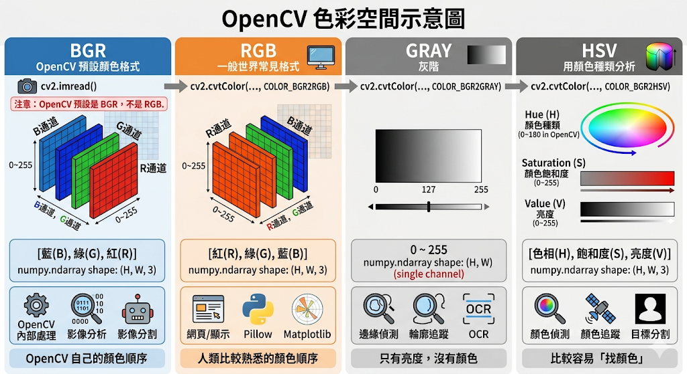

### [BGR：OpenCV預設看到的顏色](./OpenCV_src/BGR：OpenCV預設看到的顏色.py)

OpenCV 讀圖片時，預設格式是 BGR。

也就是每一個像素的順序是：[Blue, Green, Red]；不是我們平常習慣的：[Red, Green, Blue]

這也是很多初學者第一次用 Matplotlib 顯示 OpenCV 圖片時，顏色怪怪的原因。

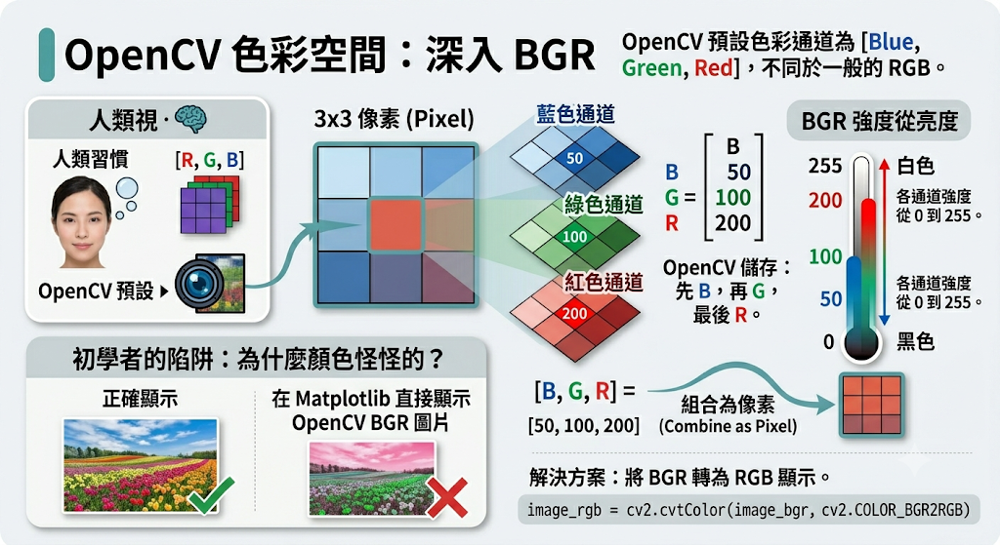

### [HSV：更適合用來找顏色](./OpenCV_src/HSV：更適合用來找顏色.py)

HSV 是很重要的色彩空間。它把顏色拆成三個概念：

```
H = Hue，色相，也就是顏色種類 -> H：這是什麼顏色？紅色、黃色、綠色、藍色？
S = Saturation，飽和度，也就是顏色濃不濃 -> S：這個顏色鮮不鮮豔？
V = Value，明度，也就是亮不亮 -> V：這個顏色亮不亮？
```

為什麼 HSV 適合找顏色？

因為 RGB 或 BGR 會受到光線影響比較大。例如同一顆紅球：

```
在陽光下：很亮的紅色
在陰影中：比較暗的紅色
```

用 RGB 看，數值可能差很多。但用 HSV 看，它們的 Hue 可能還是接近紅色範圍。所以做顏色偵測時，HSV 很常用。

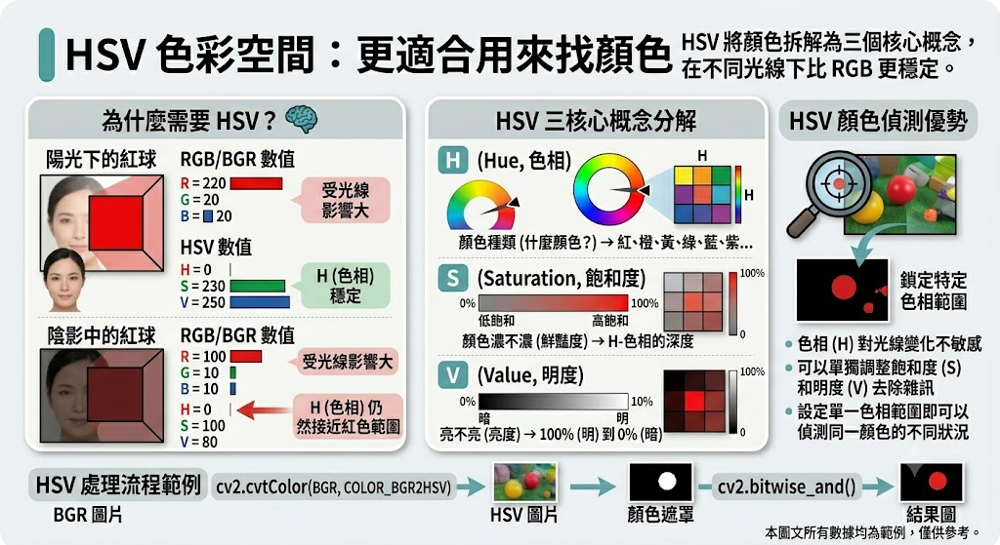

## 繪圖與標註

OpenCV 可直接在圖片上畫線、矩形、圓、文字。這是做偵測結果視覺化的基礎。

常用函式：

- `cv2.line`
- `cv2.rectangle`
- `cv2.circle`
- `cv2.putText`

- [範例：畫直線](./OpenCV_src/畫直線.py)
- [範例：畫矩形](./OpenCV_src/畫矩形.py)
- [範例：畫圓形+加文字](./OpenCV_src/畫圓形+加文字.py)

## 平滑、去雜訊與銳化

影像處理其實很像在修照片。

照片有時候會出現一些小問題：

| 問題     | 看起來像什麼                 | 可以怎麼處理 |
| -------- | ---------------------------- | ------------ |
| 雜訊     | 畫面有小顆粒、小黑點、小白點 | 平滑、模糊   |
| 邊緣太硬 | 畫面不自然、有鋸齒感         | 平滑         |
| 畫面太糊 | 細節不清楚                   | 銳化         |

### [平滑](./OpenCV_src/平滑.py)

平滑可以先理解成：

- 讓圖片看起來比較柔和。
- 它會把附近像素的顏色「混在一起平均一下」。所以小雜訊會被淡化。

但缺點也很明顯：平滑太多，圖片會變糊。

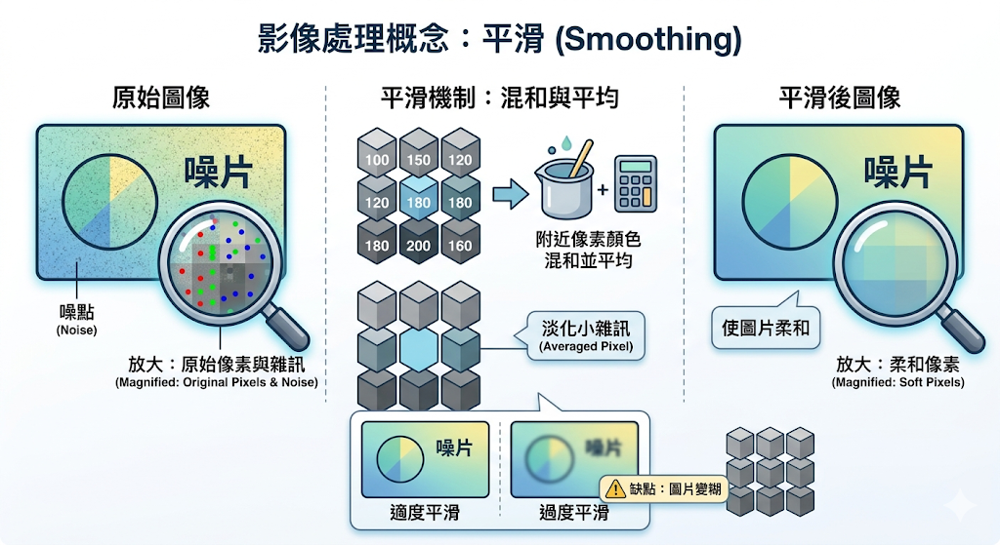

### [銳化](./OpenCV_src/銳化.py)

銳化剛好相反。

平滑是讓畫面變柔。銳化是讓畫面變清楚。

它會讓邊緣、線條、輪廓更明顯。

| 原圖狀態       | 銳化後         |
| -------------- | -------------- |
| 文字有點糊     | 文字邊緣更清楚 |
| 物體輪廓不明顯 | 輪廓更突出     |
| 細節偏軟       | 細節變硬一點   |

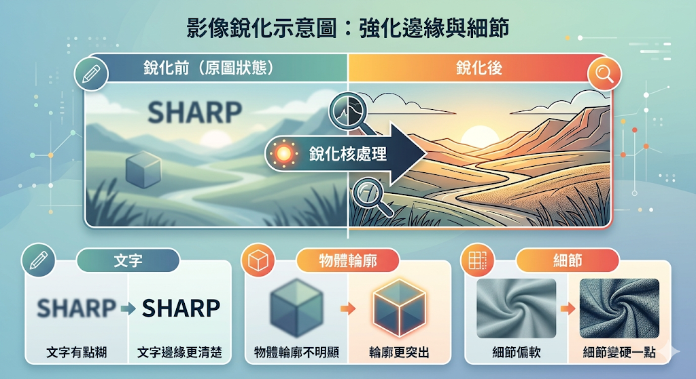

## [閾值處理](./OpenCV_src/閾值處理.py)

閾值處理(Thresholding)，你可以把它想成：「幫圖片做二選一判斷。」例如：

- 太亮 → 變白色
- 太暗 → 變黑色

最後圖片通常只剩黑白兩種顏色。

常見方法：

- 固定閾值：`cv2.threshold`
- Otsu 自動閾值：適合雙峰分布
- 自適應閾值：適合光線不均

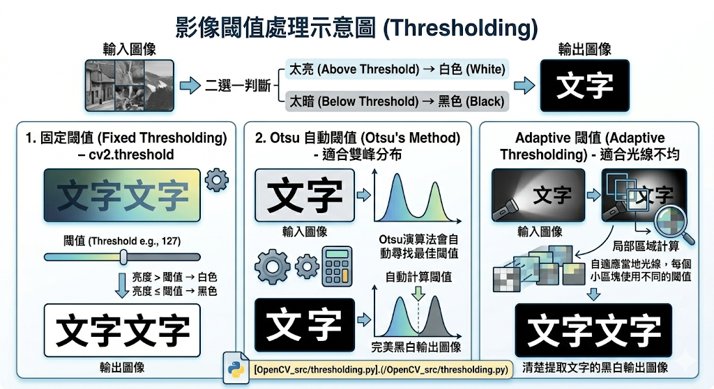

## [形態學](./OpenCV_src/形態學.py)

形態學(Morphology)，你可以把它想成：「修圖工具。」

但它修的不是漂亮。而是修：雜點、破洞、黏在一起的物件、太細的區域

形態學通常用在：黑白圖(binary image)也就是：

- 黑色背景
- 白色物件

例如：

- 白色 = 想保留的東西
- 黑色 = 背景

OpenCV 會一直對白色區域動手腳。

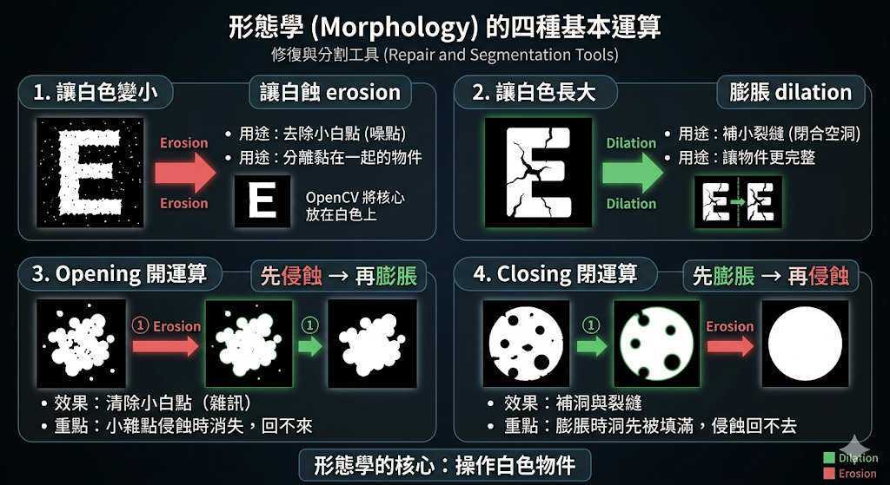

### [侵蝕(erosion)](./OpenCV_src/侵蝕.py)：

「把白色慢慢吃掉。」白色區域會變小。
用途很常是：

- 去除小白點雜訊
- 分離黏在一起的物件

### 膨脹 dilation

膨脹跟侵蝕相反。它會：「讓白色長大。」

用途：

- 補小裂縫
- 讓文字更粗
- 讓物件更完整

### Opening 開運算

開運算：先侵蝕 → 再膨脹

很多學生第一次會問：「啊不是又縮小又放大？」

其實重點是：小雜點通常在侵蝕時就直接消失了。後面再膨脹也回不來。所以效果會像：「清除小白點。」

### Closing 閉運算

閉運算：先膨脹 → 再侵蝕

這次目的變成：「補洞。」

因為膨脹時：小黑洞可能先被填滿。後面侵蝕時，洞已經消失了。

## [邊緣偵測(Edge Detection)](./OpenCV_src/Canny邊緣偵測.py)

想像一張圖片：

```
白色區域      黑色區域

255 255 255 | 0 0 0
255 255 255 | 0 0 0
255 255 255 | 0 0 0
# 左邊很亮(255)，右邊很暗(0)，中間差距非常大：255 → 0
# 電腦就會認為：這裡可能有邊緣
```

所以邊緣其實就是：像素亮度突然改變的地方。

- [範例：找出圖片輪廓](./OpenCV_src/找出圖片輪廓.py)
- [範例：調整Canny閾值](./OpenCV_src/調整Canny閾值.py)
- [範例：人物照片邊緣化.py](./OpenCV_src/人物照片邊緣化.py)

## [輪廓偵測(Contours)](./OpenCV_src/Contours輪廓偵測.py)

當我們看到一張圖片時，可以很自然地知道：

- 哪裡有一顆球
- 哪裡有一張桌子
- 哪裡有一隻貓

但電腦其實不知道。對電腦來說，圖片只是一堆數字。

所以如果想讓電腦知道：

```
這裡有一個物件
這裡有兩個物件
這個物件有多大
這個物件長什麼形狀
```

就需要用到輪廓偵測 (Contour Detection)。輪廓偵測流程如下：

```
原圖
↓
灰階
↓
二值化
↓
findContours()
↓
取得輪廓
```

- [範例：找出矩形輪廓](./OpenCV_src/找出矩形輪廓.py)
- [範例：數有幾個圓](./OpenCV_src/數有幾個圓.py)
- [範例：計算面積](./OpenCV_src/計算面積.py)
- [範例：計算物件中心點](./OpenCV_src/計算物件中心點.py)
- [範例：偵測出各式圖形](./OpenCV_src/偵測出各式圖形.py)
- [範例：辨識出各式圖形](./OpenCV_src/辨識出各式圖形.py)
- [範例：人體剪影偵測](./OpenCV_src/人體剪影偵測.py)

## [影片與攝影機](./OpenCV_src/影片與攝影機.py)

OpenCV 可讀影片檔或 webcam：

```python
cap = cv2.VideoCapture(0)
while True:
    ok, frame = cap.read()
    if not ok:
        break
```

- 記得 `cap.release()`
- 迴圈中要處理按鍵中斷
- 影片輸出要設定 codec、fps、大小

## 影像特效

- [範例：灰階風](./OpenCV_src/灰階風.py)
- [範例：底片風](./OpenCV_src/底片風.py)
- [範例：模糊風](./OpenCV_src/模糊風.py)
- [範例：銳化風](./OpenCV_src/銳化風.py)
- [範例：浮雕風](./OpenCV_src/浮雕風.py)
- [範例：熱感應風](./OpenCV_src/熱感應風.py)
- [範例：素描風](./OpenCV_src/素描風.py)
- [範例：卡通風](./OpenCV_src/卡通風.py)
- [範例：馬賽克風](./OpenCV_src/馬賽克風.py)

## 模板比對(Template Matching)

想像一下，你在玩「大家來找碴」。

老師給你一張大圖片。桌上有：

```
手機
水杯
筆記本
滑鼠
鍵盤
```

然後再給你一張小圖片：滑鼠

你的任務是在大圖片中找到滑鼠的位置

人類通常一眼就能找到。但電腦不知道什麼是滑鼠。它只能一個位置、一個位置慢慢比對：

- 這裡像不像？
- 這裡像不像？
- 這裡像不像？

直到找到最相似的位置。

這種方法就叫做：Template Matching模板比對。

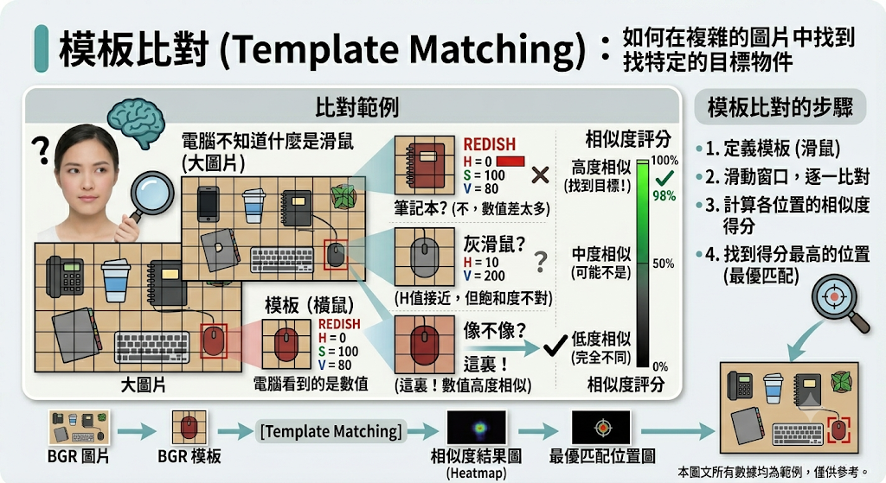

## [動態偵測](./OpenCV_src/動態偵測.py)

動態偵測可以用背景差分：

- 前後影格相減
- 背景模型：`cv2.createBackgroundSubtractorMOG2`
- 找出變動區域輪廓

應用：

- 監視器移動偵測
- 流量偵測
- 簡易安全警報

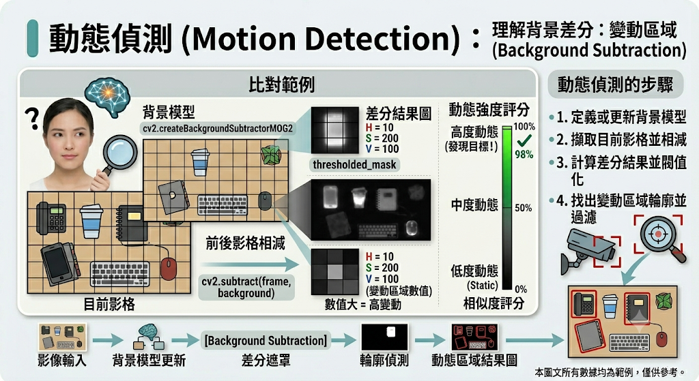

## [文件掃描(Document Scanner)](./OpenCV_src/文件掃描.py)

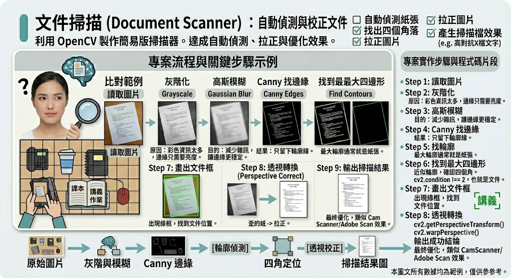

## 背景去除

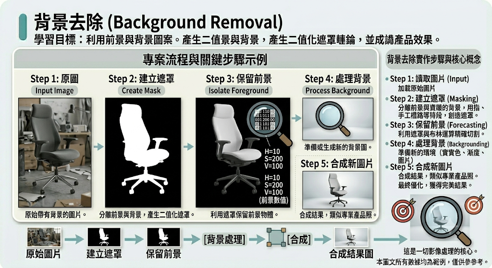

- [範例：Webcam背景變黑](./OpenCV_src/Webcam背景變黑.py)
- [範例：Webcam更換背景顏色](./OpenCV_src/Webcam更換背景顏色.py)人物保留，背景變成藍色。
- [範例：Webcam背景模糊](./OpenCV_src/Webcam背景模糊.py)，這個最像手機人像模式。

## 基於 YuNet 即時人臉偵測(Face Detection)

OpenCV 除了傳統 Haar Cascade，也支援較新的 YuNet 人臉偵測模型。

YuNet 比 Haar 更適合 webcam 即時應用，對光線、角度與多人畫面的穩定度也更好，很適合拿來做 AI 視覺入門專題。

- YuNet 是 OpenCV 較新的輕量人臉偵測方案，比 Haar Cascade 更適合即時 webcam 應用
- YuNet 負責「找出臉在哪裡」，不是辨識「這個人是誰」
- 若要做人臉辨識，可以把 YuNet 偵測到的臉部區域，再交給 DeepFace、InsightFace 或 face_recognition 處理

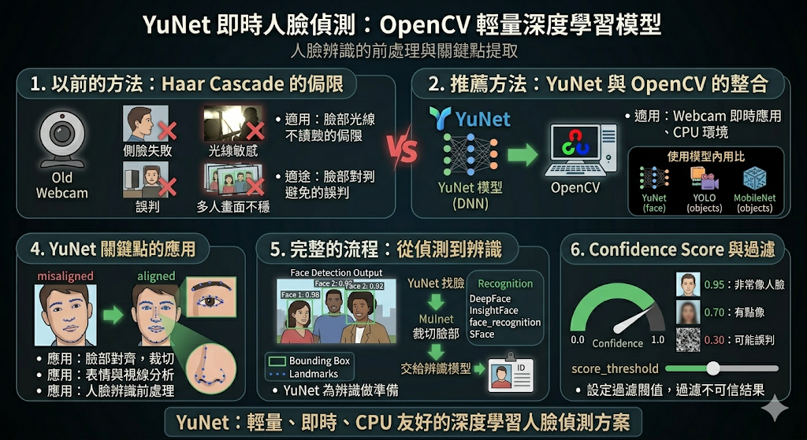

- [範例：基於YuNet做Webcam即時人數統計](./OpenCV_src/YuNet做Webcam即時人數統計.py)
- [範例：基於YuNet做Webcam即時人臉追蹤](./OpenCV_src/YuNet做Webcam即時人臉追蹤.py)
- [範例：基於YuNet做Webcam即時自動拍照](./OpenCV_src/YuNet做Webcam即時自動拍照.py)
- [範例：基於YuNet做Webcam即時臉部裁切](./OpenCV_src/YuNet做Webcam即時臉部裁切.py)
- [範例：基於YuNet做Webcam即時背景模糊](./OpenCV_src/YuNet做Webcam即時背景模糊.py)

## 基於 SFace 即時人臉辨識(Face Recognition)

前面的 YuNet負責的是人臉偵測(Face Detection)

SFace 是 OpenCV 支援的人臉辨識模型。它本質上是一個：

- 深度學習(DNN)
- Face Embedding
- 特徵向量模型

SFace 的流程如下：

```
YuNet 找到人臉
↓
裁切臉部
↓
SFace 萃取特徵
↓
比較特徵距離
↓
判斷是否同一人
```

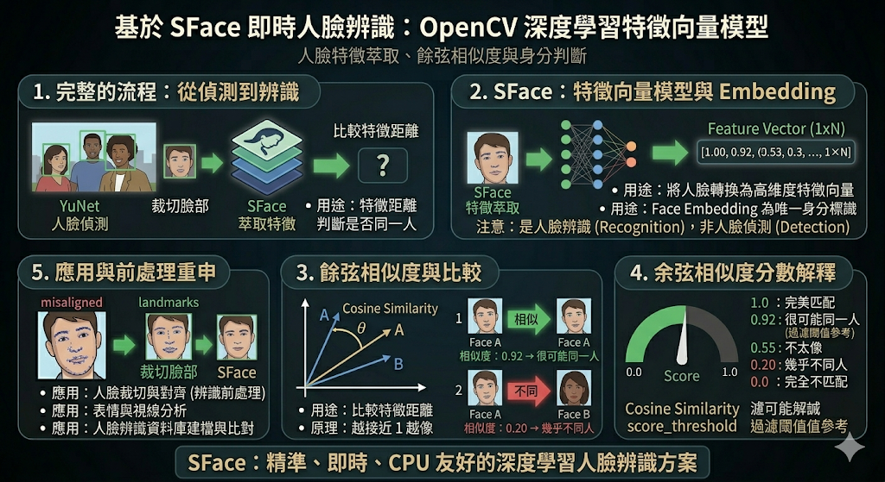

### Cosine Similarity 是什麼？

SFace 很常使用餘弦相似度(Cosine Similarity)判斷兩張臉有多像。

| 分數     | 意思   |
| -------- | ------ |
| 越接近 1 | 越像   |
| 越接近 0 | 越不像 |

| 相似度 | 結果         |
| ------ | ------------ |
| 0.92   | 很可能同一人 |
| 0.55   | 不太像       |
| 0.20   | 幾乎不同人   |

- [範例：基於SFace做人臉相似度分析](./OpenCV_src/SFace做人臉相似度分析.py)
  - 請先用手機找好一張朱大哥找片
  - 下面這兩個模型手動下載好，放到OpenCV_datasets資料夾：
    - [face_detection_yunet_2023mar.onnx下載位置](https://github.com/opencv/opencv_zoo/blob/main/models/face_detection_yunet/face_detection_yunet_2023mar.onnx)
    - [face_recognition_sface_2021dec.onnx下載位置](https://github.com/opencv/opencv_zoo/blob/main/models/face_recognition_sface/face_recognition_sface_2021dec.onnx)
- [範例：基於SFace做人臉辨識系統](./OpenCV_src/SFace做人臉辨識系統.py)

## OpenCV + Gemini

### [OpenCV+Gemini美食分析](./OpenCV_src/OpenCV+Gemini美食分析.py)

使用者可以上傳一張食物照片，程式會：

```
1. 使用 OpenCV 讀取圖片
2. 自動壓縮圖片，避免圖片太大
3. 將圖片送給 Gemini 分析
4. 回傳食物名稱、熱量估計、蛋白質來源、減脂建議
5. 使用 Gradio 做成簡單網頁介面
```

### [OpenCV+Gemini寵物溝通師](./OpenCV_src/OpenCV+Gemini寵物溝通師.py)

### [OpenCV+Gemini塔羅解牌](./OpenCV_src/OpenCV+Gemini塔羅解牌.py)

- [塔羅抽牌程式](https://tarothall.com/draw)
