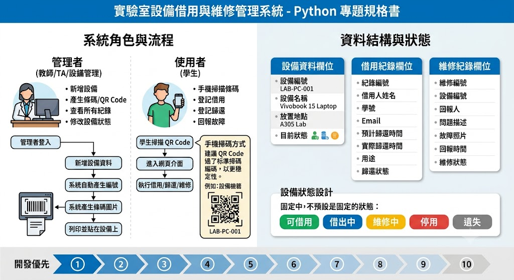

# 實驗室設備借用與維修管理系統

每一台設備都會有自己的條碼，學生或助教可以用手機打開網頁，掃描設備條碼後完成：

- 設備借用
- 設備歸還
- 維修登記
- 維修完成
- 查詢設備狀態
- 查詢歷史紀錄



## 系統角色

### 管理者

管理者通常是老師、助教、實驗室負責人。

可以做：

- 新增設備
- 修改設備資料
- 產生設備條碼
- 查看所有設備
- 查看所有借用紀錄
- 查看維修紀錄
- 修改設備狀態

### 使用者

使用者通常是學生。

可以做：

- 掃描設備條碼
- 登記借用
- 登記歸還
- 回報設備故障
- 查看自己借用紀錄

### 設備資料欄位

每一台設備至少要有這些資料：

```text
設備編號
設備名稱
設備類別
設備品牌
設備型號
放置地點
目前狀態
購買日期
備註
條碼圖片路徑
建立時間
更新時間
```

範例：

```text
設備編號：LAB-PC-001
設備名稱：筆記型電腦
設備類別：電腦設備
設備品牌：ASUS
設備型號：Vivobook 15
放置地點：A305 實驗室
目前狀態：可借用
購買日期：2026-03-01
備註：附充電器
```

---

# 四、設備狀態設計

設備狀態建議固定成這幾種：

```text
可借用
借出中
維修中
停用
遺失
```

不要讓學生自由輸入狀態，不然資料會亂掉。

例如有人輸入：

```text
維修
修理中
壞掉
不能用
故障中
```

這些其實都代表同一件事。
系統應該用下拉選單讓使用者選。

---

# 五、借用紀錄欄位

每一次借用都要留下紀錄。

```text
紀錄編號
設備編號
設備名稱
借用人姓名
借用人學號
借用人 Email
借用時間
預計歸還時間
實際歸還時間
借用用途
歸還狀態
備註
```

## 借用狀態

```text
借用中
已歸還
逾期
取消
```

---

# 六、維修紀錄欄位

設備壞掉時，要能登記維修。

```text
維修編號
設備編號
設備名稱
回報人
問題描述
故障照片
回報時間
維修狀態
維修人員
維修完成時間
維修備註
```

## 維修狀態

```text
待處理
維修中
已完成
無法修復
```

---

# 七、系統功能規格

## 功能 1：新增設備

管理者可以輸入設備資料。

必要欄位：

```text
設備名稱
設備類別
品牌
型號
放置地點
```

系統自動產生：

```text
設備編號
條碼圖片
建立時間
目前狀態：可借用
```

設備編號格式建議：

```text
LAB-類別-流水號
```

例如：

```text
LAB-PC-001
LAB-CAM-001
LAB-MIC-001
LAB-ARD-001
```

---

## 功能 2：產生條碼

系統使用 `python-barcode` 產生條碼圖片。

條碼內容就是設備編號。

例如：

```text
LAB-PC-001
```

產生後存到：

```text
barcodes/LAB-PC-001.png
```

管理者可以下載條碼圖片，列印後貼在設備上。

---

## 功能 3：掃描條碼查詢設備

學生用手機打開 Streamlit 網頁。

掃描條碼後，系統顯示：

```text
設備名稱
設備編號
目前狀態
放置地點
是否可借用
```

如果目前狀態是「可借用」，顯示：

```text
我要借用
回報故障
```

如果目前狀態是「借出中」，顯示：

```text
目前借用人
借用時間
預計歸還時間
```

如果目前狀態是「維修中」，顯示：

```text
維修狀態
問題描述
回報時間
```

---

# 八、手機掃碼方式

Streamlit 本身不是專門做相機掃碼的框架，所以專題可以分兩階段。

## 階段一：簡化版

先不做即時掃碼。

條碼掃描器或手機掃碼 App 掃到設備編號後，貼到輸入框。

流程：

```text
手機掃條碼
取得設備編號
貼到 Streamlit 輸入框
查詢設備
```

這版最穩，也最適合初學者。

---

## 階段二：進階版

使用手機相機在網頁中掃碼。

可以考慮：

```text
HTML5 QR Code
JavaScript
Streamlit components
```

不過這部分難度比較高。
建議先用 QR Code 取代傳統條碼，因為手機掃 QR Code 比掃一維條碼穩很多。

也就是：

```text
python-barcode：產生一維條碼
qrcode：產生 QR Code
```

專題建議做法：

```text
設備貼 QR Code
手機直接掃
開啟設備頁面
```

QR Code 內容可以是：

```text
https://你的系統網址?equipment_id=LAB-PC-001
```

這樣學生手機掃完，不用複製貼上，直接進入設備頁面。

這個版本最像真的系統。

---

## 九、建議系統流程

### 新增設備流程

```text
管理者登入系統
↓
點選新增設備
↓
輸入設備資料
↓
系統產生設備編號
↓
系統產生條碼 / QR Code
↓
管理者下載圖片
↓
列印貼在設備上
```

---

### 借用流程

```text
學生掃描設備 QR Code
↓
進入設備頁面
↓
系統顯示設備狀態
↓
學生填寫姓名、學號、Email、用途、預計歸還時間
↓
按下借用
↓
系統新增借用紀錄
↓
設備狀態改成借出中
```

---

## 歸還流程

```text
學生掃描設備 QR Code
↓
系統發現設備目前借出中
↓
學生點選歸還
↓
填寫歸還備註
↓
系統更新借用紀錄
↓
設備狀態改成可借用
```

---

## 維修流程

```text
學生掃描設備 QR Code
↓
點選回報故障
↓
填寫問題描述
↓
上傳故障照片
↓
系統建立維修紀錄
↓
設備狀態改成維修中
```

## 開發順序

不要一開始就做掃碼。
那會卡很久。

建議同學照這個順序做：

```text
第 1 階段：建立資料庫
第 2 階段：新增設備
第 3 階段：顯示設備清單
第 4 階段：產生條碼 / QR Code
第 5 階段：輸入設備編號查詢
第 6 階段：借用功能
第 7 階段：歸還功能
第 8 階段：維修回報功能
第 9 階段：Dashboard 統計
第 10 階段：手機掃 QR Code 進入設備頁
```

這樣做比較不會崩。
學生每完成一階段，都可以看到成果。

## 進階功能

做得比較快的同學可以加：

```text
登入系統
管理者權限
Email 通知
LINE 通知
Google Sheets 雲端同步
設備照片
逾期提醒
匯出 Excel
維修照片上傳
借用紀錄搜尋
設備分類篩選
```

最推薦加的是：

```text
匯出 Excel
逾期提醒
Google Sheets 同步
```

因為這三個最有實務感。
