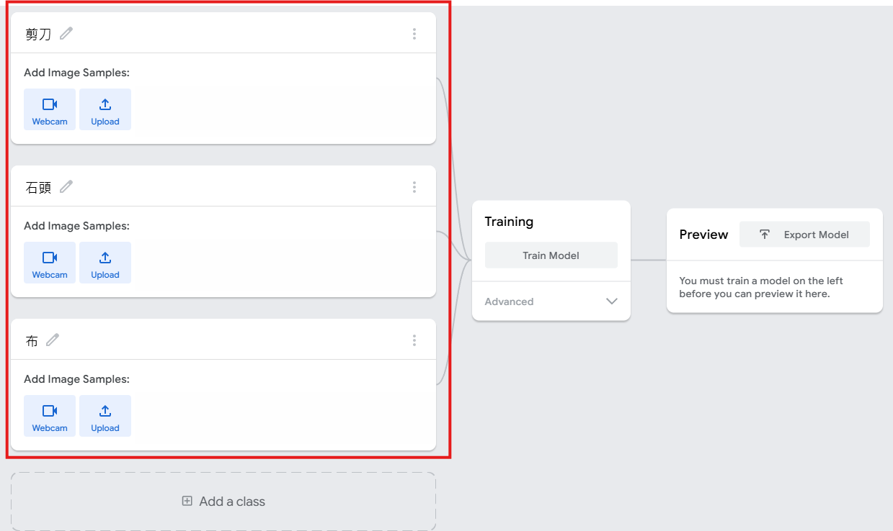

- 點擊：Get Started
- 選擇：Image Project
- 選擇模型：Standard Image Model即可。
- 建立類別：將預設類別改成：

```
剪刀
石頭
布
```



- 開始訓練：點擊：Train Model
- 測試模型：訓練完成後。右側會出現：Preview攝影機畫面。
- 匯出模型：點擊：Export Model
  - TensorFlow.js：它可以直接在瀏覽器執行。因此最適合：HTML、JavaScript、網頁作品。
  - TensorFlow：
  - TensorFlow Lite：
- 結合 Gemini 生成網頁

## 提示詞

```
幫我設計一個現代化 AI 辨識剪刀石頭布網站

# 技術
請使用 HTML、CSS、JavaScript

# 需求：

1. 使用 Teachable Machine 模型
2. 顯示攝影機畫面
3. 顯示辨識結果
4. 顯示信心分數
5. 使用玻璃擬態風格
6. 支援手機版(RWD)

以下是模型程式碼：

[貼上 Teachable Machine 程式碼]
<!-- https://teachablemachine.withgoogle.com/models/7cWCT9-M_/ -->
```
