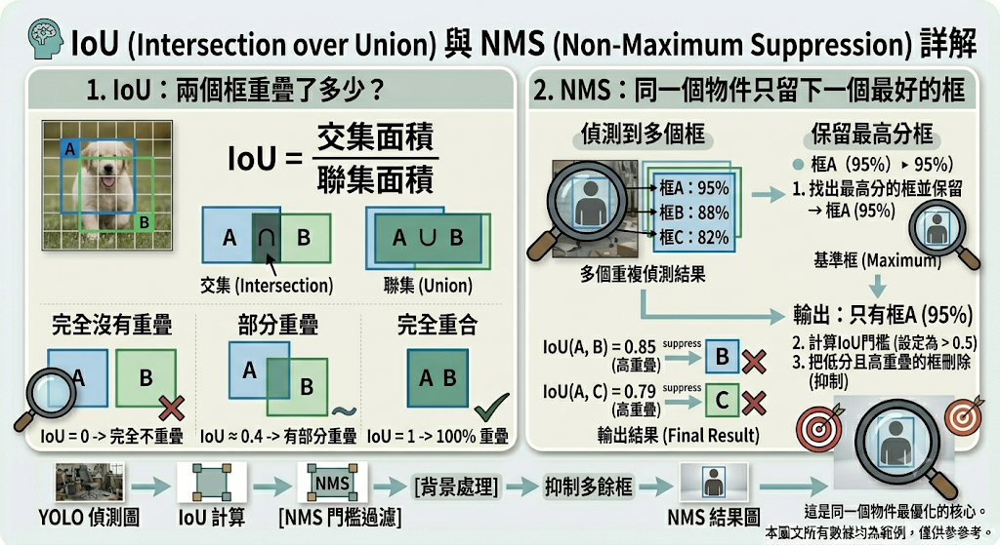

# YOLOv8

YOLOv8 很像一位看過大量圖片的「快速盤點員」。給它一張影像，它可以回答：

- 畫面裡有哪些已學過的物件？
- 每個物件大概在哪裡？
- 它對答案有多大把握？

但 YOLOv8 不會自動知道所有商業規則。例如「這個人進入禁區了」「這台車停超過五分鐘」「這位顧客已經計數過」都需要 Python、OpenCV、追蹤器或其他模型協助。

## 電腦如何看圖片

人看到的是「教室裡有三個人」。電腦先看到的是很多數字。

一張彩色圖片可以想成一張超大的方格紙。每一格是 pixel，也就是像素。OpenCV 通常把每個像素記成三個數字：

```text
[藍色, 綠色, 紅色]
```

例如：

```text
[0, 0, 0]       黑色
[255, 255, 255] 白色
[0, 0, 255]     紅色
```

假設圖片尺寸是 `1280 x 720`，代表橫向 1280 個像素、縱向 720 個像素。彩色圖片在 NumPy 中的形狀通常是：

```python
(720, 1280, 3)
```

順序是高度、寬度、色彩通道。這也是初學者常把 x、y、寬、高弄反的地方。

## YOLO 到底是什麼

YOLO 是 You Only Look Once 的縮寫。核心精神是讓神經網路一次處理整張圖並直接預測物件位置與類別，因此適合需要速度的即時應用。

可以把模型推論想成考試：

1. 圖片先縮放成模型需要的尺寸。
2. 神經網路把像素逐層轉換成特徵。
3. 模型提出很多候選框。
4. 每個候選框有類別與信心分數。
5. NMS 清除大量重複框。
6. 程式取得最後結果。

「模型權重」就是它從訓練資料中學到的大量參數。`yolov8n.pt` 中：

- `yolov8`：模型世代。
- `n`：nano，小而快，適合入門。
- `.pt`：PyTorch 權重檔。

YOLOv8 常見尺寸由小到大為 `n`、`s`、`m`、`l`、`x`。模型越大通常需要更多記憶體與運算時間，不保證在每個專案都比較好。職訓教室先用 nano 把流程跑通，再比較其他尺寸。

> Ultralytics 已持續推出其他世代模型。本教材刻意使用 `yolov8n.pt`，因為課程主題是 YOLOv8，不把「套件有更新」誤說成「YOLOv8 不存在」。

## 邊界框座標

程式推論常讀到 `xyxy`：

```text
x1, y1, x2, y2
```

- `(x1, y1)`：左上角。
- `(x2, y2)`：右下角。

框的寬高：

```python
width = x2 - x1
height = y2 - y1
```

框的中心：

```python
center_x = (x1 + x2) / 2
center_y = (y1 + y2) / 2
```

YOLO 標註檔則使用：

```text
class_id x_center y_center width height
```

而且四個幾何數字都要除以圖片寬高，變成 `0` 到 `1`。這麼做是為了讓標註不綁死在某個解析度。

## IoU 與 NMS

當 YOLO 偵測物件時，並不是一開始就只畫出一個框。實際上，模型會先產生很多個候選框(Candidate Boxes)。

例如畫面中有一個人，模型可能同時給出：

```
框A：信心值 95%
框B：信心值 88%
框C：信心值 81%
```

三個框其實都在框同一個人。

如果全部保留，畫面就會變成：人 → 被畫三個框，看起來非常混亂。因此需要兩個重要機制：

- IoU (Intersection over Union)
- NMS (Non-Maximum Suppression)



### IoU (Intersection over Union)

IoU 可以理解成「兩個框有多像？」，或者說「兩個框重疊了多少？」

```
IoU=聯集面積/交集面積​

# 交集(Intersection) = 兩個框共同覆蓋的區域
# 聯集(Union) = 兩個框合併後的總面積
```

#### 範例：完全沒有重疊

```
┌─────┐     ┌─────┐
│  A  │     │  B  │
└─────┘     └─────┘
# A 和 B 完全分開。
# IoU = 0 -> 完全不像
```

#### 範例：部分重疊

```
┌─────────┐
│    A    │
│   ┌─────┼────┐
└───┼─────┘ B  │
    └──────────┘

# A 與 B 有部分重疊。A 與 B 有部分重疊。
# IoU ≈ 0.4 -> 有點像，但不完全相同
```

#### 範例：完全重合

```
┌─────────┐
│    A    │
│    B    │
└─────────┘

# 兩個框完全一樣。
# IoU = 1 -> 100%重疊。
```

### NMS (Non-Maximum Suppression)

其實概念超簡單：同一個物件只留下一個最好的框。

假設 YOLO 偵測到：

```
框A：95%
框B：88%
框C：82%
```

而且三個框都框在同一個人身上。

1. 找出最高分的框並保留 -> 框A：95%
2. 計算：IoU(A, B)跟IoU(A, C)，假設IoU(A,B)=0.85、IoU(A,C)=0.79，代表高度重疊，很可能是在描述同一個人。
3. 把較低分的框刪除

### NMS 門檻值(Threshold)

通常會設定一個 IoU 門檻。

```
IoU > 0.5：認為是同一個物件
IoU ≤ 0.5：認為是不同物件
```

## 第一階段：基礎偵測

- [範例：讀取類別、信心分數與邊界框座標](./YOLOv8_src/讀取類別、信心分數與邊界框座標.py)
- [範例：YOLOv8偵測一張街景圖片](./YOLOv8_src/YOLOv8偵測一張街景圖片.py)
- [範例：YOLOv8偵測街景影片](./YOLOv8_src/YOLOv8偵測街景影片.py)
  - [下載：車流影片素材](https://www.pexels.com/zh-tw/video/8915716/)
- [範例：YOLOv8即時攝影機偵測](./YOLOv8_src/YOLOv8即時攝影機偵測.py)

## [COCO](https://cocodataset.org/#home)

COCO 全名Common Objects in Context，中文可以翻成「情境中的常見物件資料集」。
COCO 裡面有33萬張以上圖片，以及250萬個以上標註物件

## 第二階段：統計分析

### [YOLOv8教室人數統計](./YOLOv8_src/YOLOv8教室人數統計.py)

程式每一幀偵測 `person`，把框數當作當下人數，並每秒寫一筆 CSV。

這個方法的限制：

- 遮擋嚴重會漏人。
- 海報或螢幕中的人可能被誤認。
- 人走出畫面後人數會下降，這是「當下畫面人數」，不是「今天到過的人數」。
- 同一個人是否曾經出現過，需要追蹤或身分辨識，不能只靠單幀偵測。

### YOLOv8即時車流辨識

- [臺南市即時交通資訊服務網](https://tntcc.tainan.gov.tw/)：選取一個路口監視器，複製圖片網址。
- [範例：YOLOv8即時車流辨識](./YOLOv8_src/YOLOv8即時車流辨識.py)
- [範例：YOLOv8即時車流辨識-只保留車輛類別](./YOLOv8_src/YOLOv8即時車流辨識-只保留車輛類別只保留車輛類別.py)
- [範例：YOLOv8即時車流辨識-車流量統計](./YOLOv8_src/YOLOv8即時車流辨識-車流量統計.py)
- [範例：YOLOv8即時車流辨識-車流趨勢圖(CSV + Matplotlib)](./YOLOv8_src/YOLOv8即時車流辨識-車流趨勢圖.py)

### [YOLOv8東京街頭散步-Youtube行人影像辨識](./YOLOv8_src/YOLOv8東京街頭散步-Youtube行人影像辨識.py)

### [YOLOv8大稻埕碼頭-Youtube直播行人辨識](./YOLOv8_src/YOLOv8大稻埕碼頭-Youtube直播行人辨識.py)

### [YOLOv8球賽人員辨識](./YOLOv8_src/YOLOv8球賽人員辨識.py)

COCO 80 類別中：
| 類別 | ID |
| ------------ | -- |
| person | 0 |
| sports ball | 32 |
| baseball bat | 34 |

因此可以針對棒球相關物件進行偵測。

<!-- ## 第三階段：事件偵測 -->

<!-- ## 第四階段：工安應用 -->

<!-- ## 第五階段：智慧交通 -->

<!-- ## 第六階段：零售商店 -->
